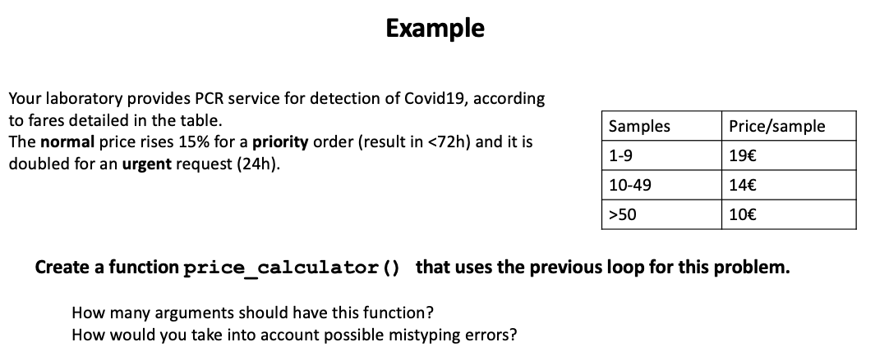

```{r wrap-hook, echo=FALSE}
library(knitr)
library(formatR)
opts_chunk$set(tidy.opts=list(width.cutoff=60),tidy=TRUE)

```

# R packages

R is a '[GNU Software](https://en.wikipedia.org/wiki/GNU)' with a [GPL](https://en.wikipedia.org/wiki/GNU_General_Public_License) license. As a a freely available language it has a great community of users from diverse background and interests. This community have developed a myriad of applications for R, called ***R Packages***. Packages are the fundamental units of reproducible R code. They include reusable R functions, the documentation that describes how to use them, and sample data. The idea behind R packages is that the chances are that someone has already solved a problem that you're working on, and you can benefit from their work by downloading their package.

Packages can be installed from one of the public R repositories. In this course we will use two R repos, [**CRAN**](https://cran.r-project.org/) and [**Bioconductor**](https://www.bioconductor.org/). The name CRAN stands for "The Comprehensive R Archive Network", and it contains a huge variety of packages free to use. On the other hand, as we will see later on, Bioconductor is a repository of software devoted to bioinformatics or computational biology applications. As for August 2022, the CRAN package repository features 18,558 available packages whereas Bioconductor release 3.15 contains 2,140 packages.

A full list of CRAN packages can be found [here](https://cran.r-project.org/web/packages/available_packages_by_name.html) and a list by topic [here](https://cran.r-project.org/web/views/).

## Installing and use R packages

As an example, we are going to install and use `SeqinR`, a handy package to work with biological sequences.

```{r, error=TRUE}
#install
install.packages("seqinr")

#load
library(seqinr) 

#trick to install package only if not installed 
if(!require(seqinr)){
    install.packages("seqinr")
    library(seqinr)
}
```

Notice that in the above code we have used `require()` and `library()` functions to call for package loading. Those are very similar functions, often interchangeable. The main difference is that if you use `require()`*,* you will get a warning (see below for *warning* use), but not an error. Thus, your code will continue to run if possible.

```{r, error=TRUE}
library(uam)
require(uam)
```

Many packages in CRAN also contain a reference manual and some of them also a *vignette*. A vignette is practical guide to each package. You can see all the installed vignettes with [`browseVignettes()`](https://rdrr.io/r/utils/browseVignettes.html). You can find a bunch of tutorials and tricks about how to use popular packages, but the *vignette* is an official and complete reference that is always helpful.

```{r, error=TRUE}
browseVignettes("seqinr") 
browseVignettes("ggplot2")
```

# Create user-written functions

## Why? How?

We have discussed thoroughout the last weeks how R can help you if you to save time when you need to analyze and plot the data from your experiment. However, many times, particularly in Bioinformatics, you won't have the data from one single experiment but from many of them.

Creating you own function will be very useful for automation of repetitive analyses or to encapsulate a sequence of expressions that need to be executed numerous times, perhaps under slightly different conditions. Functions are also often written when code must be shared with others or the public.

In R, functions are also considered as objects. That means that (1) they can be nested, so you can define a function inside another function and (2) you can use funcions as arguments to other functions. We will see very useful examples of this latter feature in Lesson 12, using custom functions as arguments for `lapply()` or `sapply()`.

The overall scheme of an R function is the following:

    my_function <- function(argument1, argument2,...){
      statements
      return(object)
      }

## My first simple functions

We are going to learn with some examples from a good online [tutorial](https://www.geeksforgeeks.org/functions-in-r-programming/). First, a quite simple function can simply help with calculations:

```{r}
# my first function
myFunction <-  function(x){
  f <- x^2*4+x/3
  return(f)
} 
#we try it
myFunction(4)
myFunction(0)
myFunction(22)

```

We can include conditions, loops... Another example to identify even/odd numbers:

```{r}
# A simple R function to check
# whether x is even or odd

evenOdd = function(x){
if(x %% 2 == 0)
	return("even")
else
	return("odd")
}

#test
evenOdd(4)
evenOdd(3)
```

Sometimes creating an R script file, you want to create a small function and use it just once. To deal with those situations, you can use the *inline* function. To create an inline function you have to use the function command with the argument x and then the expression of the function. 

Example:

```{r}
# inline functions
f <-  function(x) x^2*4+x/3

f(4)
f(0)
f(22)
```

## Functions with multiple arguments

Now, we will create a function in R Language that will take multiple inputs and gives us one output.

```{r}
# A simple R function to calculate
# area and perimeter of a rectangle

area  <-  function(length, width){
  area = length * width
  #you may format the output
  print(paste("The area of the rectangle is", length, "x", width, "=", area, "cm²"))
}

area(2,3) # call the function
```

Notice that the output also can be a vector or a list:

```{r}
# Now we calculate area and perimeter of a rectangle


Rectangle <-  function(length, width){
  area = length * width
  perimeter = 2 * (length + width)

# create an object called result which is
# a list of area and perimeter
  result = list("Area" = area, "Perimeter" = perimeter)
  return(result)
}

Rectangle(2, 3)
```

If you may want to have more flexibility to parse date, you can the names of the variables when calling the function. Also, you can add some default values.

```{r}
# A simple R program to demonstrate
# passing arguments to a function

Rectangle <-  function(length=5, width=4){
area = length * width
return(area)
}

# Case 1:
Rectangle(2, 3)

# Case 2: If you do not want to follow any order, 
#you can include the name of the arguments
Rectangle(width = 8, length = 4)

# Case 3: default's values
Rectangle()

```

## Including checkpoints

Now we are going to try a longer code.



```{r}
#we need to arguments
price_calculator <- function(samples, category){
  categories<-c(1,1.15,2)
  names(categories)=c("normal","priority","urgent")
  if(samples < 10 ){
    price<-19 * samples * which(names(categories)==category)
  } else if (samples < 50 ){
    price<-14 * samples * which(names(categories)==category)
  } else if (samples >= 50  ){
    price<-10 * samples * which(names(categories)==category)
  } else {
    #if we cannot calculate the price we return a message
    price<-paste("No se ha podido calcular el precio. Revise los datos introducidos")
  }
paste(price)
}

#new version with checkpoints
price_calculator <- function(samples, category = "normal"|"priority"|"urgent"){
    category <-  switch (category,
      normal = 1,
      priority = 1.5,
      urgent = 2)
    if(samples < 10 ){
      price <- 19 * samples * category
    } else if (samples < 50 ){
      price <- 14 * samples * category
    } else if (samples >= 50  ){
      price <- 10 * samples * category
    } 
    ifelse(length(price) > 0, return(price), stop("Prioridad incorecta. No se ha podido calcular el precio")  )
}
price_calculator(5.3,"normal")
#WTF?
```

Can we check for the format of the input?

```{r, error=TRUE}
#alternative with checkpoint for number of samples
price_calculator <- function(samples, category = "normal"|"priority"|"urgent"){
  category <-  switch (category,
                       normal = 1,
                       priority = 1.5,
                       urgent = 2)
  if (abs(floor(samples)) != samples){ # check that number of samples is an integer number
    stop("Número de muestras incorrecto")
  }
  if(samples < 10 ){
    price <- 19 * samples * category
  } else if (samples < 50 ){
    price <- 14 * samples * category
  } else if (samples >= 50  ){
    price <- 10 * samples * category
  } 
  ifelse(length(price) > 0, return(price), stop("Prioridad incorecta. No se ha podido calcular el precio")  )
}

#test again
price_calculator(50, "urgente")
price_calculator(50, "urgent")
price_calculator(-5, "normal")
price_calculator(5.2, "normal")
```

## In-class exercise

When creating functions, you can include any R functionality, including reading external data. Let's check the following example, within the context of molecular biology. It makes a short function that convert R into a molecular biology dogma interpreter. It takes as input a nucleic acid sequence codon and returns its encoded amino acid in IUPAC one letter code.

```{r, error=TRUE}
#the molecular biology dogma with R

codon2aa <- function(inputCodon) {
  aa<-c()
  code<-read.csv2("../data/genetic_code.csv", stringsAsFactors = FALSE)
  aa <- code$AA[code$Codon==inputCodon]
  return(aa)
}

#now let's try it
codon2aa("ATG")
codon2aa("TAA")
codon2aa("CAT")
codon2aa("AXG")

#Can you check the value of the variable 'aa'
aa
```

What just happened? There are a few things worth to comment here:

1.  When writing a function, we need to define a vector before assigning it a value.

2.  If the function cannot find the right value to return, the output is empty: `character(0)`

3.  The variable `aa` seems nonexistent! Variables defined in a function are only **local variables** and cannot be called outside the function.

However, proteins are made up of more than one amino acid, so it'd be great if the input could be a vector of several codons instead a single codon.

Additionally, we can customize how R handles the empty returns. This allow us helping the user to use our code and preventing errors.

```{r, error=TRUE}
#version 2

codon2aa_2 <- function(codons) {
  aa<-c()
  code<-read.csv2("../data/genetic_code.csv", stringsAsFactors = FALSE)
  for (i in 1:length(codons)){ #loop over all the elements of the vector 'codons'
    if(codons[i] %in% code$Codon){ #check for correct values
      aa[i] <- code$AA[code$Codon==codons[i]]
    } else {
      stop("Uno o más de los codones no es correcto. No se ha podido traducir.")
      #break and message in case of empty return
    }
  }
  return(aa)
}

#let's try it
codon2aa_2(c("ATG","TGA"))
codon2aa_2(c("ARG","TGA"))
codon2aa_2(c("ATG","CAT", "CAT","AAA","TAA"))

```

# References

-   *R packages*, <https://r-pkgs.org/index.html>

-   *R programming for data science,* <https://bookdown.org/rdpeng/rprogdatascience/>

-   Creating functions in *Programming in R* Swcarpentry, <http://swcarpentry.github.io/r-novice-inflammation/02-func-R/index.html>

-   Functions in R programming in *GeeksforGeeks*: <https://www.geeksforgeeks.org/functions-in-r-programming/>

# Short exercises

#### 1. Install the package `readxl` and read the file *coli_genomes.xls* in the *data* folder.

#### 2. Export the dataframe from exercise 1 as a *csv* file. Read it as a new dataframe object. Is there any difference between the two dataframes?

#### 3. Write a function called micro() that transforms concentrations units: molar (M) into micromolar (µM)

#### 4. Write a function that transform mass into concentration (in µM and with four decimal digits). For simplicity, we can consider that the units of mass, molecular weight and volume are µg, kg/mol and µL, respectively.

#### **5. Write a function that calculate your approximate age in months.**

Check the functions `date()`, `Sys.Date()`, `as.Date()`, and `difftime()`. See some examples [here](https://bookdown.org/rdpeng/rprogdatascience/dates-and-times.html) or [here](https://www.geeksforgeeks.org/calculate-time-difference-between-dates-in-r-programming-difftime-function/#:~:text=Calculate%20Time%20Difference%20between%20Dates%20in%20R%20Programming%20%E2%80%93%20difftime()%20Function,-View%20Discussion&text=difftime()%20function%20in%20R,%2C%20months%2C%20years%2C%20etc.&text=units%3A%20Days%2C%20weeks%2C%20months%2C%20etc.).\

## More exercises...

<https://www.r-bloggers.com/2016/02/functions-exercises/>

<http://mathcenter.oxford.emory.edu/site/math117/probSetRFunctions/>

# Script-ing

#### Write a function that translate any nucleotide sequence into a protein sequence.

Hints:

1.  You may need to check for the number of nucleotides (i) and the number of codons (j=i/3) in the sequence.

2.  You may use the function `substr()` to divide the sequence into codons. To do so, you may use a loop that split the nucleotides in groups of three (For instance, being the last nucleotide *j x 3* and the first *(j x 3) -2)*.

3.  You would add a `warning()` call when 1-2 nucleotides at the end of the sequence are not used.

4.  Finally, use the package ***seqinr*** to read the fasta file *lacZ.fa.* Note that sequence objects are nested lists, thus, you'll need to extract the sequence as a plain text.
