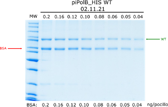

```{r wrap-hook, echo=FALSE}
library(knitr)
library(formatR)
opts_chunk$set(tidy.opts=list(width.cutoff=60),tidy=TRUE)
knitr::opts_knit$set(root.dir = "/Users/modesto/data/HPBBM2022")
options(repos = list(CRAN="http://cran.rstudio.com/")) #this is to avoid error in install.packages() at knitting
```

# [Wellcome & Disclaimer]{style="color:cornflowerblue"}

This site contains the materials for the *Coding tools for Biochemistry & Molecular Biology* (Herramientas de Programación para Bioquímica y Biología Molecular) course of fall 2022 in the Bachelor's Degree in Biochemistry \@UAM. This materials are the basis for GitHub-pages-based website that can be accessed [here](https://mredrejo.github.io/HPBBM2022/). Detailed academic information about the course contents, dates and assessment only can be found at the UAM Moodle site.

All this material is open access and it is shared under [CC BY-NC](https://creativecommons.org/licenses/by-nc/2.0/) license.

# Plot your data in R

## Quick Plotting in R

R has a number of built-in tools for diverse graph types such as histograms, scatter plots, stricharts, bar charts, boxplots, and more. Indeed, there are many functions in R to produce plots ranging from the very basic to the highly complex. We will show a few examples and use the plots as an excuse to add some new tricks for data analysis.

In Lesson 13 we will use the ggplot2 package for efficient generation of complex and cool plots. However, you will see that it's sometimes useful to use the plotting functions in base R. These are installed by default with R and do not require any additional packages to be installed. They're quick to type, straightforward to use in simple cases, and run very quickly. Then, if you want to do anything beyond very simple plots, though, it's generally better to switch to *ggplot2*. In fact, once you already know how to use R's base graphics, having these examples side by side will help you transition to using *ggplot2* for when you want to make more sophisticated graphics.

The function `plot()` can be used to generate different types of plots, as detailed in the table and examples below.


For the first examples, we are going to review also some R functions to make up data following certain distributions, using functions like `rnorm()` or `dnorm()` for generation of normal data or normal density curves. The same can be obtained for *Poisson* distribution with `dpois()` and `rpois()`.

```{r}
#generate some sample data with normal distribution
x <- rnorm(500)
y <- x + rnorm(500)
plot(x)
hist(x)
plot(x, y)
plot(dnorm(0:100,mean=50,sd=5))


#customized Example
plot(x, y, pch = 21,
     bg = "red",   # Fill color
     col = "blue", # Border color
     cex = 3,      # Symbol size
     lwd = 3)      # Border width
```

### Example Plot 1: [coli_genomes_renamed.csv](../data/coli_genomes_renamed.csv)

Now let's plot our data.

```{r}
coli_genomes <- read.csv2(file = 'data/coli_genomes_renamed.csv', strip.white = TRUE, stringsAsFactors = TRUE)
attach(coli_genomes)
#one variable
plot(Year)
#a factor
plot(Source)
#two variables
plot(Contigs, kmer)
#factor + numeric variable and saving the plot
png(file="plot1.png")  #give it a file name
plot(Source,Contigs)  #construct the plot
dev.off()  #save
```

As shown in the example, in order to save a plot, we must follow three steps:

1.  Open the file indicating the format: `png()`, `jpg()`, `svg()`, `postscript()`, `bmp()`, `win.metafile()`, or `pdf()`.

2.  Plot the data.

3.  Close the file: `dev.off()`.

Alternatively, you can save the plot using the **Plot** menu or the **Plots panel**: *Export* --\> *Save as Image* or *Save as PDF.*

As you may know, the R function `cor()` calculate the correlation coefficient between two or more vectors and `cor.test()` allow us to quickly perform a correlation test between two variables to know if the correlation is statistically significant. However, a quick plot can be also very useful.

In our table, we have some features of a list of *E. coli* isolates and the basic stats of the genome sequencing. Regarding this data, do you think that the number of contigs \> 1kb in the genome assemblies (*contigs1kb*) correlates with the total number of contigs (*Contigs*), the average contig length (*average_contig*) or the number of contigs that contain 50% of the genome (*N50*). Let's check the data using simple plots with the `plot()` function.

```{r, fig.width=6, fig.height=12}
#correlation plots
par(mfrow = c(3, 1))
plot(coli_genomes$contigs1kb ~ coli_genomes$Contigs, xlab="Contigs", ylab="Contigs > 1kb")
abline(lm(coli_genomes$contigs1kb ~ coli_genomes$Contigs), col="red")
plot(coli_genomes$contigs1kb ~ coli_genomes$N50,  xlab="N50", ylab="Contigs > 1kb")
abline(lm(coli_genomes$contigs1kb ~ coli_genomes$N50), col="red")
plot(coli_genomes$contigs1kb ~ coli_genomes$average_contig, xlab="Average contig", ylab="Contigs > 1kb")
abline(lm(coli_genomes$contigs1kb ~ coli_genomes$average_contig), col="red")

#now we will check with a cor.test and add some text to the plot
(test1 <- cor.test(coli_genomes$contigs1kb, coli_genomes$Contigs))
(test2 <- cor.test(coli_genomes$contigs1kb, coli_genomes$N50))
(test3 <- cor.test(coli_genomes$contigs1kb, coli_genomes$average_contig))
str(test1)

plot(coli_genomes$contigs1kb ~ coli_genomes$Contigs, xlab="Contigs", ylab="Contigs > 1kb")
abline(lm(coli_genomes$contigs1kb ~ coli_genomes$Contigs), col="red")
text(200,200,paste("Pearson r2=",round(test1$estimate,2)))
plot(coli_genomes$contigs1kb ~ coli_genomes$N50,  xlab="N50", ylab="Contigs > 1kb")
abline(lm(coli_genomes$contigs1kb ~ coli_genomes$N50), col="red")
text(250000,200,paste("Pearson r2=",round(test2$estimate,2)))
plot(coli_genomes$contigs1kb ~ coli_genomes$average_contig, xlab="Average contig", ylab="Contigs > 1kb")
abline(lm(coli_genomes$contigs1kb ~ coli_genomes$average_contig), col="red")
text(40000,200,paste("Pearson r2=",round(test3$estimate,2)))

#oh wait! why only one-vs-one?
plot(coli_genomes[,c("VF","Plasmids","kmer","Contigs","N50","longest.contig..bp.","Assembly_length","contigs1kb","average_contig")], main = "Multiple Correlation plot")
```

## Selecting the right plot

Data visualizations are a vital component of a data analysis, as they have the capability of summarizing large amounts of data efficiently in a graphical format and bring out new insights that can be difficult to understand from raw data. There are many chart types available, each with its own strengths and use cases. One of the trickiest parts of the analysis process is choosing the right way to represent your data using one of these visualizations. A wrong plot can lead to confusion or data misinterpretation (see some examples of bad graphs [here](https://www.analyticsvidhya.com/blog/2021/02/data-visualization-bad-representation-of-data/)).

From the perspective of classical data analysis, the first consideration to select the right plot is the nature of your variables. Some plots are recommended for numerical data (quantitative variables) and other for categorical data (qualitative variables). Then, you should considering the role for your data visualization, i.e, question you want to address or the message you want to transmit. That will depend on how many variables, as well as their distribution, grouping or correlation.

You can see a description of some of the more common plots, with examples [here](https://intro2r.com/simple-base-r-plots.html) or [here](https://hbctraining.github.io/Intro-to-R/lessons/basic_plots_in_r.html). Rather than going through all of them, we are going to use some examples to learn some basic plotting and see the effect of plot selection in order to understand your data and use them to answer questions.

### Example Plot 2: [*Zebrafish_data.csv*](../data/Zebrafish_data.csv)

We are loading again the table described in [Lesson 12](Lesson_12_data_management/12_adv_data_management.html#zebra) and we will try out some plots.

```{r, error=TRUE, fig.width=12, fig.height=6}
#read data
ZFdata <- read.csv("data/Zebrafish_data.csv")

#some plots
barplot(ZFdata)
barplot(ZFdata$pLoC)
par(mfrow=c(1,3)) #arrange the three plots in a row 
barplot(ZFdata$pLoC, col="red", main="pLoc")
barplot(ZFdata$EFNA3, col="green", main="EFNA3")
barplot(ZFdata$NC1s, col="blue",main="NC1s")
par(mfrow=c(2,3)) #arrange the three plots in a row 
stripchart(ZFdata$pLoC, main="pLoc")
stripchart(ZFdata$pLoC, method="stack", col="red", main="pLoc")
stripchart(ZFdata$pLoC, method="overplot", col="red",  main="pLoc")
stripchart(ZFdata$pLoC, method="jitter", col="red", main="pLoc")
stripchart(ZFdata$EFNA3, method = "stack",col="green", main="EFNA3")
stripchart(ZFdata$NC1s, method = "stack",col="blue", main="N1cs")
par(mfrow=c(1,3)) #arrange the three plots in a row 
hist(ZFdata$pLoC, col="red",  main="pLoc")
hist(ZFdata$EFNA3, col="green", main="EFNA3")
hist(ZFdata$NC1s, col="blue", main="N1cs")
par(mfrow=c(1,3)) #arrange the three plots in a row 
boxplot(ZFdata$pLoC, col="red",  main="pLoc")
boxplot(ZFdata$EFNA3,  col="green", main="EFNA3")
boxplot(ZFdata$NC1s, col="blue", main="N1cs")


```

Now try to answer some questions about your data and obtained plots:

1.  Which construct has the strongest impact on the disemination of metastatic cells?

2.  Which plot represent best the data?

3.  Does a barplot represent the same information than a boxplot?

Now, we are going to represent the same data again.

```{r}
oldpar <- par() #save original settings (optional)
par(mfrow = c(1, 3), cex.lab = 1, cex = 1, lwd = 2) #new settings

hist(ZFdata$pLoC, col=rgb(1,0,0,0.5),  main="pLoc", ylim = c(0,20), xlim = c(0,120), xlab = "Number of Metastatic cells")
hist(ZFdata$EFNA3, col=rgb(0,1,0,0.5),  main="EFNA3", ylim = c(0,20), xlim = c(0,120), xlab = "Number of Metastatic cells")
hist(ZFdata$NC1s, col=rgb(0,0,1,0.5),  main="NC1s", ylim = c(0,20), xlim = c(0,120), xlab = "Number of Metastatic cells")

stripchart(ZFdata$pLoC, method="jitter", pch=19, col=rgb(1,0,0,0.5), vertical=TRUE,  main="pLoc", ylim = c(0,120), xlab = "Number of Metastatic cells")
stripchart(ZFdata$EFNA3, method="jitter", pch=19, col=rgb(0,1,0,0.5), vertical=TRUE, main="EFNA3", ylim = c(0,120), xlab = "Number of Metastatic cells")
stripchart(ZFdata$EFNA3, method="jitter", pch=19, col=rgb(0,1,0,0.5), vertical=TRUE, main="EFNA3", ylim = c(0,120), xlab = "Number of Metastatic cells")

boxplot(ZFdata$pLoC, col=rgb(1,0,0,0.5),  ylim = c(0,120), xlab = "Number of Metastatic cells", main="pLoc")
boxplot(ZFdata$EFNA3, col=rgb(0,1,0,0.5), ylim = c(0,120), xlab = "Number of Metastatic cells",  main="EFNA3")
boxplot(ZFdata$NC1s, col=rgb(0,0,1,0.5), ylim = c(0,120), xlab = "Number of Metastatic cells", main="N1cs")

par(oldpar) #restore (optional)
#alternatively you can reset par with: par(no.readonly = TRUE) 
```

In these plots above, you can see how plots can be deeply customized, and you can select colors (by name, RGB, hex or HSV code), size and shape of the points (`cex` and `pch`), plot and axis titles (`main`, `xlab` and `ylab`) and some tricks to avoid points overlapping (`method = "jitter"` or `method="stacked"`). Also, we have used the function `par()` to arrange the plots integrated as a single plot. This is a very useful function that can be used to set or query many graphical parameters (see below). The arguments `mfrow` and `mfcol` are very useful to place graphs indicating the row and cols (or cols and row in `mfcol`). However, any other graph customization can be included here to avoid reapeat it during the plot.

*Do you think, you can answer better the questions now?*

Beyond some basic examples of plotting in R, the take-home message of this example is that the type of plot and the plot parameters (in this case the scale) can be essential for correct interpretation of the data and if they are not properly adjusted the plot can be strongly misleading.

Further, to compare three conditions, we needed to make three independent plots. However, in the table, there are actually six conditions, and it is easy to imagine a table with more conditions. How could you plot that? Here is where the generation of a datamatrix table, as shown in Lesson 12 is very important.

```{r}
ZF_stacked <- stack(ZFdata)

boxplot(ZF_stacked$values ~ ZF_stacked$ind,  col=c(rgb(1,0,0,0.5),rgb(0,1,0,0.5),rgb(0,0,1,0.5),rgb(1,0.5,0,0.5),rgb(0.5,0.5,0.5,0.5),rgb(0,1,1,0.5)))
colorines=c(rgb(1,0,0,0.5),rgb(0,1,0,0.5),rgb(0,0,1,0.5),rgb(1,0.5,0,0.5),rgb(0.5,0.5,0.5,0.5),rgb(0,1,1,0.5)) #define the colors for the whole analysis
boxplot(ZF_stacked$values ~ ZF_stacked$ind,  col=colorines)

stripchart(ZF_stacked$values ~ ZF_stacked$ind, vertical = TRUE, method="jitter", col=colorines, pch=19, cex=1, ylab="Number of cells", xlab="Plasmid")

#what about barplot?
means <- aggregate(values ~ ind, data=ZF_stacked, mean) #you can use by() or tapply()
barplot(means$values, ylim=c(0,120), col=colorines, ylab="Number of cells", xlab="Plasmid")
```

The stripchart and the boxplot strongly suggest that NC2s is probably the strongest transcript, but that is not shown in the barplot. These plots clearly show that barplots are intended for single values (categorical data) and can mislead your conclusions.

## Plot customization

There are many options to customize your plots, including font type and size, point shape, line type... You can see more info on the [References](#refs) section below. Let's see some examples using code I borrow from <https://r-coder.com/plot-r/>

```{r}
#point shape with "pch"
r <- c(sapply(seq(5, 25, 5), function(i) rep(i, 5)))
t <- rep(seq(25, 5, -5), 5)

plot(r, t, pch = 1:25, cex = 3, yaxt = "n", xaxt = "n",
     ann = FALSE, xlim = c(3, 27), lwd = 1:3)
text(r - 1.5, t, 1:25)

#line type with "lty"
M <- matrix(1:36, ncol = 6)
matplot(M, type = c("l"), lty = 1:6, col = "black", lwd = 3)

# Just to indicate the line types in the plot
j <- 0
invisible(sapply(seq(4, 40, by = 6),
                 function(i) {
                   j <<- j + 1
                   text(2, i, paste("lty =", j))}))


#plot box
par(mfrow = c(2, 3))

#plots
plot(x, y, bty = "o", main = "Default")
plot(x, y, bty = "7", main = "bty = '7'")
plot(x, y, bty = "L", main = "bty = 'L'")
plot(x, y, bty = "U", main = "bty = 'U'")
plot(x, y, bty = "C", main = "bty = 'C'")
plot(x, y, bty = "n", main = "bty = 'n'")

par(mfrow = c(1, 1))

```

### Example Plot 3: more customization

Now let's think again in our *E. coli* genomes. How would you add more layers of information to the plot, like labels of specific points.

```{r}
#point labels

# Create the plot
plot(coli_genomes$contigs1kb ~ coli_genomes$Contigs, pch=19,col=rgb(1,0,0,0.5), xlab="Contigs", ylab="Contigs > 1kb")

# Plot the labels
text(coli_genomes$contigs1kb ~ coli_genomes$Contigs,
     labels = coli_genomes$Strain,
     cex = 0.6, pos = 4, col = "red")

#only some points
selected <- c(7, 17, 18)
plot(coli_genomes$contigs1kb ~ coli_genomes$Contigs, pch=19,col=rgb(1,0,0,0.5), xlab="Contigs", ylab="Contigs > 1kb")

# Index the elements with the vector
text(coli_genomes$contigs1kb[selected] ~ coli_genomes$Contigs[selected],
     labels = coli_genomes$Strain[selected],
     cex = 0.6, pos = 4, col = "red")

#another different example
attach(USJudgeRatings)
plot(FAMI, INTG,
     main = "Familiarity with law vs Judicial integrity",
     xlab = "Familiarity", ylab = "Integrity",
     pch = 18, col = "blue")
text(FAMI, INTG,
     labels = row.names(USJudgeRatings),
     cex = 0.6, pos = 4, col = "red")
detach(USJudgeRatings)
```

You can look for more custom options because there are a lot. I also suggest looking at the `identify()` function, which allows the quick interactive identification and labeling of selected points.

How would you plot several variables by groups? For this, we can use a loop or an *apply* family trick (see Lesson 12).

```{r}
#grouping
par(mfrow=c(1,3) ) 
#how can you generate several plots for different variable by factors??

#option 1: looping
system.time(for (i in 9:11){
  boxplot(by(coli_genomes[,i],coli_genomes$Source,summary),main=names(coli_genomes[i]))
})

#option2: lapply
ploteando <- function(x) {boxplot(by(x,coli_genomes$Source,summary))}
system.time(lapply(coli_genomes[,9:11],FUN=ploteando))

```

In this example `lapply()` returns a list of plots but (in this case with only 3 plots) you can notice that it is not faster than a loop. Finally, loops are not so slow on R, at least small loops.

### [Exercise]{style="color:green"}

Repeat the scatterplot above of *contigs1kb* vs. *Contigs,* but coloring the points by *Source* as in the plot below. You just need to assign the colors in the plot to a new vector that encodes the levels of the factor as colors.

Finally, use the function `legend()` to add a legend.

```{r echo=FALSE, warning=FALSE}

colorines <- sapply(coli_genomes$Source, FUN= function(x) switch(x,"Avian"=rgb(1,0,0,0.5),"Human"=rgb(0,1,0,0.5),"Porcine"=rgb(0,0,1,0.5)))
names(colorines) <- coli_genomes$Source

#plot
plot(coli_genomes$contigs1kb ~ coli_genomes$Contigs, pch=19,col=colorines, xlab="Contigs", ylab="Contigs > 1kb")

#legend
legend(100,200, fill=unique(colorines),legend=unique(names(colorines)),ncol=2)
```

Here is the code for the plot, with some more options:

```{r warning=FALSE, eval=FALSE}
coli_genomes <- read.csv2(file = 'data/coli_genomes_renamed.csv', strip.white = TRUE, stringsAsFactors = TRUE)
colorines <- sapply(coli_genomes$Source, FUN= function(x) switch(x,"Avian"=rgb(1,0,0,0.5),"Human"=rgb(0,1,0,0.5),"Porcine"=rgb(0,0,1,0.5)))
names(colorines) <- coli_genomes$Source

#option2: swicth in character vector will keep the original as names
colorines2 <- sapply(as.character(coli_genomes$Source), FUN= function(x) switch(x,"Avian"=rgb(1,0,0,0.5),"Human"=rgb(0,1,0,0.5),"Porcine"=rgb(0,0,1,0.5)))
all.equal(colorines,colorines2) #is the same?

#plot
plot(coli_genomes$contigs1kb ~ coli_genomes$Contigs, pch=19,col=colorines2, xlab="Contigs", ylab="Contigs > 1kb")

#legend
legend(100,200, fill=unique(colorines2),legend=unique(names(colorines2)),ncol=2)
legend("top", fill=unique(colorines2),legend=unique(names(colorines2)),ncol=2)
legend("bottom", fill=unique(colorines2),legend=unique(names(colorines2)),ncol=2)
legend("topright", fill=unique(colorines2),legend=unique(names(colorines2)),ncol=2)
```

# References {#refs}

-   *R in action.* Robert I. Kabacoff. March 2022 ISBN 9781617296055

-   R Graphics Cookbook: <https://r-graphics.org/> (Chapter 2).

-   Graphics with Base R: <https://intro2r.com/graphics_base_r.html>

-   [Beyond Bar and Line Graphs: Time for a New Data Presentation Paradigm (Weissberger et al. Plos Biology 2015).](https://journals.plos.org/plosbiology/article?id=10.1371/journal.pbio.1002128)

-   I also advise checking articles and posts that you can find with Google, such as:

    -   How to choose the right chart for your data: <https://dexibit.com/how-to-choose-the-right-chart-to-visualize-your-data/>

    -   How to choose the Right Chart for Data Visualization: <https://www.analyticsvidhya.com/blog/2021/09/how-to-choose-the-right-chart-for-data-visualization/>

    -   Basic plots in R: <https://hbctraining.github.io/Intro-to-R/lessons/basic_plots_in_r.html>

    -   R Base Plotting: <https://rstudio-pubs-static.s3.amazonaws.com/84527_6b8334fd3d9348579681b24d156e7e9d.html>

    -   Base plotting in R: <https://towardsdatascience.com/base-plotting-in-r-eb365da06b22>

# [Exercises]{style="color:green"}

#### 1. Let's suppose we have the expression data for two genes (GeneA and GeneB) in 50 patients, 30 with colon cancer and 20 with lung cancer. {#ex1}

**For the exercise, we are using random data, generated as follows:**

```{r eval=FALSE}
(GeneA <- rnorm(50)) 
(GeneB <- c(rep(-1, 30), rep(2, 20)) + rnorm(50))
(tumor <- factor(c(rep("Colon", 30), rep("Lung", 20))))
```

**a. Before plotting the data, how would you test if there is difference in the expression level by the type of tumor?**

**b. Plot boxplots and density curves of the expression of both genes by type of tumor. Do the plots agree with your answer to the question a?**

[**Tips.**]{.underline} **Check out the functions `density()` and `lines()` in order to plot the density curves and `polygon()` if you want to have filled the area below the curves. Also, note that when plotting multiple lines, you must set the axis limits with the `xlim` and `ylim` arguments when plotting the first curve.**

#### 2. Replica plot.

**The file *aapc.csv* is a plain text file that contains information amino acid composition in all the sequences deposited in the UniProtKB/Swiss-Prot protein data base. Use that file to reproduce the following barplot.**

{width="499"}

#### 3. A classic in biochemistry lab: Protein quantification (with special thanks to Carmen Mayoral). You have probably done that with Excel or GraphPad, but after this exercise I'm sure you'll consider a definitive upgrade in your protocols.

**In our lab, we often purify recombinant DNA polymerases. We have recently purify a *WT* and *mutant* proteins, and we want to quantify the amount of pure proteins using a SDS-PAGE. To do so, we loaded decreasing volumes of the protein preparation (serial dilutions, but expresed as volume of the original sample in µL) along with known amounts (ng) of bovine seroalbumin (BSA) as a pattern, as in the image below. Bands were densitometer using [ImageJ](https://openwetware.org/wiki/Protein_Quantification_Using_ImageJ) opensource software (arbitrary units). The data are in three tables containing the BSA pattern (triplicates in [bsa_pattern.csv](../data/bsa_pattern.csv)), the results for the wt protein ([curve_wt.csv](../data/curve_wt.csv)) and for the mutant ([curve_mut.csv](../data/curve_mut.csv)).**



1.  **Plot the correlation between BSA amounts and the bands density. Color the points by the replicate and include the linear model line, as well as the Pearson R^2^.**

2.  **Use the linear model to obtain the concentration (µM) of *wt* and *mutant* protein preparations. Consider the same molecular weight of 99 kDa for both proteins.**

# [Extra exercises]{style="color:green"}

-   R Bloggers exercises: <https://www.r-bloggers.com/2016/09/advanced-base-graphics-exercises/>

-   More solved exercises (with a Bioinformatics flavor!!):

    -   Text: <https://www.bioinformatics.babraham.ac.uk/training/Core_R_Plotting/Core%20R%20Plotting%20Exercises.pdf>

    -   Data: <https://www.bioinformatics.babraham.ac.uk/training/Core_R_Plotting/Core%20R%20Plotting%20Data.zip>

    -   Answers: <https://www.bioinformatics.babraham.ac.uk/training/Core_R_Plotting/core_r_plotting_exericse_answers.nb.html>

# Session Info

```{r}
sessionInfo()
```

# [Course home](https://mredrejo.github.io/HPBBM2022/)

### [Lesson 9: Data input and output in R](../Lesson_9_input_output/9_input_output.html)

### [Lesson 10: Write your own functions](../Lesson_10_Functions/10_Functions.html)

### [Lesson 12: Data management](../Lesson_12_data_management/12_adv_data_management.html)

### [Lesson 13: Advanced plots with ggplot](../Lesson_13_ggplot/13_ggplotting.html)

### [Lesson 14: Applications for Molecular Biology](../Lesson_14_R_for_molbiol/14_R4bqbm.html)

### [Extra Lesson: Introduction to R projects, R Markdown and Quarto.](../Lesson_E_markdown/E_markdown.html)
