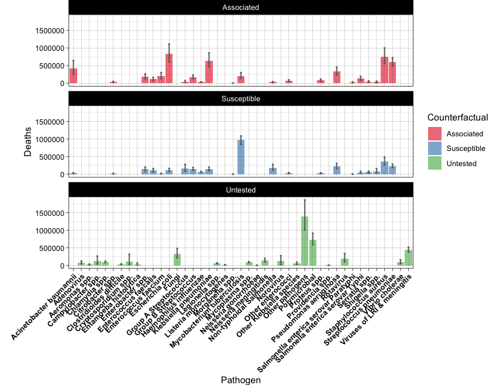

```{r wrap-hook, echo=FALSE}
library(knitr)
library(formatR)
opts_chunk$set(tidy.opts=list(width.cutoff=60),tidy=TRUE)
knitr::opts_knit$set(root.dir = "/Users/modesto/data/HPBBM2022")
options(repos = list(CRAN="http://cran.rstudio.com/")) #this is to avoid error in install.packages() at knitting
```

# [Wellcome & Disclaimer]{style="color:cornflowerblue"}

This site contains the materials for the *Coding tools for Biochemistry & Molecular Biology* (Herramientas de Programación para Bioquímica y Biología Molecular) course of fall 2022 in the Bachelor's Degree in Biochemistry \@UAM. This materials are the basis for GitHub-pages-based website that can be accessed [here](https://mredrejo.github.io/HPBBM2022/). Detailed academic information about the course contents, dates and assessment only can be found at the UAM Moodle site.

All this material is open access and it is shared under [CC BY-NC](https://creativecommons.org/licenses/by-nc/2.0/) license.

# Plot your data in R - Episode II

As we discussed in [Lesson 11](Lesson_11_plots/11_basicplotting.html), exploratory data visualization is one of the greatest advantage of R. One can quickly go from idea to data to graph with a unique balance of flexibility and ease.

There are many graphing options available in R. You already know that the graphing capabilities that come with a basic installation of R are already quite useful. There are also a number of packages for creating advances graphs like *grid*, *plotly*, or *lattice*. In this course we chose to use **ggplot2** because it is widely used and also the basis of many derivative packages for specific advanced plots. The main advantage of ggplot is that it breaks plots into components in a way that allows beginners to create relatively complex and aesthetically pleasing plots using an intuitive and relatively easy-to-remember syntax.


One reason why ***ggplot2*** is generally more intuitive for beginners is because it uses a "graphing grammar" (see [Wilkinson et al.2000](https://www.tandfonline.com/doi/abs/10.1080/10618600.2000.10474897)), the *gg* of *ggplot2*. This is analogous to the way that learning a language grammar can help you construct hundreds of different sentences out of a small number of verbs, nouns, and adjectives, rather than memorizing each specific sentence. Similarly, by learning a small amount of the basic components of *ggplot2* and the [elements in its grammar]{.underline}, you will be able to create hundreds of different plots to show and render the data exactly in the way you think it's the best way.

## Example 1: Advanced plotting with ggplot in one line

```{r}
#load the data
library(data.table)
vaccines<-fread('data/vaccines_EU_22oct2022.csv')
#install & load ggplot2
if(!require(ggplot2)) install.packages("ggplot2")
library(ggplot2)
#plot
ggplot(vaccines, aes(x = YearWeekISO, y = log10(FirstDose), col=TargetGroup), stat=mean) +
    geom_point() +   facet_wrap(~ ReportingCountry)
```

Although it should have taken a while, in the above code you generated a complex graphic in only one line. This examples contains four basic elements:

1.  Data (in this case vaccines)

2.  Aesthetic: `aes()`

3.  Layer: `geom()`

4.  Facet: `facet_wrap()`

However, these are not all the possible elements in a *ggplot* coding. As with any language, the grammar of graphics can be [flexible]{.underline} and we may omit some elements o add more elements of the same type, just like we can add diverse kinds of complements (place, time...) to a sentence.

From a general perspective (see ref. [3](https://ggplot2-book.org/index.html)), plots are composed of the **data**, the information you want to visualize, and a **mapping**, the description of how the data's variables are mapped to aesthetic attributes. There are five mapping components (again from ref. [3](https://ggplot2-book.org/index.html)):

-   A **layer** is a collection of geometric elements and statistical transformations. Geometric elements, **geom**s for short, represent what you actually see in the plot: points, lines, polygons, maps, etc. Statistical transformations, **stat**s for short, summarize the data: for example, binning and counting observations to create a histogram, or fitting a linear model.

-   **Scale**s map values in the data space to values in the aesthetic space. This includes the use of colour, shape or size. Scales also draw the legend and axes, which make it possible to read the original data values from the plot (an inverse mapping).

-   A **coord**, or coordinate system, describes how data coordinates are mapped to the plane of the graphic. It also provides axes and gridlines to help read the graph. We normally use the Cartesian coordinate system, but a number of others are available, including polar coordinates and map projections.

-   A **facet** specifies how (usually a factor type vector) to break up and display subsets of data as small multiples. This is also known as conditioning or latticing.

-   A **theme** controls the finer points of display, like the font size and background colour. While the defaults in ggplot2 have been chosen with care, you may need to consult other references to create an attractive plot.

Let's see all those element through more examples.

## Example 2: From R base plot to ggplot

The use of *ggplot* is usually associate to great, gorgeous charts and plots. However, once you learn how to use it and how adapt and readapt code to your data, you will probably use ggplot for every graph.

In the following code, we are going to use *ggplot* to solve the [exercise 1 from Lesson 11](Lesson_11_plots/11_basicplotting.html#ex1).

```{r}
#create the same dataset
set.seed(2013)
(GeneA <- rnorm(50)) 
(GeneB <- c(rep(-1, 30), rep(2, 20)) + rnorm(50))
(tumor <- factor(c(rep("Colon", 30), rep("Lung", 20))))
#for ggplot it is more convenient to work with dataframes
genes <- data.frame(tumor,GeneA,GeneB)

#basic plots

#geneA
ggplot(genes, aes(x=tumor, y=GeneA,color=tumor)) +
  geom_boxplot()
#geneB with custom colors
ggplot(genes, aes(x=tumor, y=GeneB,fill=tumor)) +
  scale_fill_manual(values=c("#999999", "#E69F00")) +
  geom_boxplot()

#together
#we need to adapt dataset with stack()
genes2 <- cbind(stack(genes[,2:3]),tumor)
names(genes2) <- c("Expression","Gene","Tumor")
#generate the plot
p <- ggplot(genes2, aes(x=Gene, y=Expression,fill=Gene)) +
  scale_fill_manual(values=c("#999999", "#E69F00")) +
  geom_boxplot()
p #see the plot
p + facet_grid(.~ Tumor) #new version
```

For these simple plots, the degree of difficulty and the time consumption of making them with base R plot functions like `boxplot()` or `stripchart()` or with `ggplot()` is very similar, but this is only the very tip of the *ggplot* iceberg.

# Plots customization

Customization of your plot is very easy thanks to the *themes*, and other options, as in the examples below. Check for built-in *ggplot* themes: <https://ggplot2.tidyverse.org/reference/ggtheme.html>. Also, you can find some packages with custom themes and you can create your own theme (check [this](https://emanuelaf.github.io/own-ggplot-theme.html) article by Emanuela Furfaro).

```{r}
(q <- p + facet_grid(.~ Tumor) + theme_light())
(q2 <- p+facet_grid(.~ Tumor) + theme_dark())
(q3 <- p+facet_grid(.~ Tumor) + theme_linedraw())
q+ stat_boxplot(geom ='errorbar', width=0.5, alpha=0.5) 
q + theme(legend.position="top")
q + theme(legend.position="bottom")
q + theme(legend.position="none") 
```

Now, let's try some more cool example plots with these same data.

```{r}
r <- ggplot(genes2, aes(x=Gene, y=Expression,fill=Tumor)) +
  scale_fill_manual(values=c("#999999", "#E69F00")) +
  geom_boxplot()

r + geom_dotplot(binaxis='y', stackdir='center',
                 position=position_dodge(0.75))

r + geom_point(pch = 21, position = position_jitterdodge())

#more examples
a <- ggplot(genes2, aes(x = Expression))
a + geom_density(aes(fill = Gene),alpha=0.4) +
  scale_fill_manual(values = c("#868686FF", "#EFC000FF")) +
  theme_classic() + facet_grid(.~ Tumor)
library(RColorBrewer)
a <- ggplot(genes2, aes(x = Gene, y=Expression, fill=Tumor)) + 
  scale_fill_brewer(palette = "Pastel1") + 
  geom_violin(alpha=0.4, position="dodge")
a
```

## Color palettes

When you have large datasets or several factors in your data, selecting the colors is not trivial. In R, there are defined color combinations or palettes that you can select in your plot. Moreover, there are also several packages that contain custom color palettes suitable for base plots and/or *ggplots*, like [*viridis*](https://cran.r-project.org/web/packages/viridis/vignettes/intro-to-viridis.html) or *RColorBrewer*. You may also find interesting the package [*ggsci*](https://cran.r-project.org/web/packages/ggsci/vignettes/ggsci.html), which contains palettes with colors used in scientific journals, data visualization libraries, science fiction movies...

To obtain the desired plot, you sometimes need to rotate the axis x labels, which must be done within a `theme()` argument. You can customize the label rotation, justification, font...

```{r}
coli_genomes <- read.csv2(file = 'data/coli_genomes_renamed.csv', strip.white = TRUE, stringsAsFactors = TRUE)
p <- ggplot(coli_genomes,aes(x=Strain, y=contigs1kb, fill=Source)) + geom_bar(stat="identity", position = "dodge", alpha=0.6) 
p
p2 <- p + scale_fill_brewer(palette = "Dark2") + theme_linedraw() 
p2
p2b <- p + scale_fill_brewer(palette = "Pastel2") + theme_linedraw() 
p2b
p3 <- p2 + theme(axis.text.x = element_text(angle = 45,
    hjust = 1, face = "bold"))
p3
```

In the example above, we generated a plot with some custom palettes. The palettes are available in *ggplot*, but in order to explore and edit them, you need to install the package.

```{r}
if(!require(RColorBrewer)) install.packages("RColorBrewer")
library(RColorBrewer)
display.brewer.all()
display.brewer.all(colorblindFriendly = TRUE) #only colorblind-friendly!
#display only the a number of colors from specific palette
display.brewer.pal(n = 3, name = 'Dark2')
```

## Saving your plot

Finally, saving plots is also very easy with *ggplot2*, check the function `ggsave()`.

```{r}
#save 
ggsave(filename = "plot_p3.svg", plot = p3,width = 10,height = 6)
```

Of course, you can also do it the same way than with Base plots:

```{r}
svg("plot_p3b.svg")
print(p3)
dev.off()
```

## Example 3: Plotting multiple variables

One of the nice ways to summarize data is plotting more than one variable in the same plot. However, you should consider that different data may need different scale to be render in the same plot. Thus, you should scale up/down the data of one variable to the values of the second variable. Then, for the secondary axis, you just need to apply the same scaling factor in the opposite direction.

In the following example, we plot the number of *Contigs* and the *Assembly length* from our [*coli_genomes.csv*](../data/coli_genomes.csv).

```{r}
#barplot
plots2 <- ggplot(data=coli_genomes) + 
  geom_bar(aes(x = Strain, y = Contigs, color = Source, fill = Source), stat="identity") 
#add the points and adjust the scale in the right axis
plots2b <- plots2 +
  geom_point(aes(x = Strain, y = Assembly_length/15000,  fill = Source, alpha=0.8),col="black",shape=21, size=3)
plots2b
plots2c <- plots2b  +   scale_y_continuous(name = "Number of Contigs",limits = c(0, 400), expand=c(0,0), sec.axis = sec_axis(~15000 * ., name  = "Assembly length")) 
plots2c
#add colors and more customization
plots2custom <- plots2b +   
    scale_fill_brewer(palette = "Set1") + scale_color_brewer(palette = "Set1") +
    theme_bw() + theme(axis.text.x = element_text(angle = 45, hjust = 1, face = "bold")) +
    guides(alpha = "none", color = "none") 
plots2custom
```

We did the plot in different stages, to check each of the variables and the scale of the secondary axis before apply the customization.

As you noticed, axis customization may entail adjust the *limits* with`limits()`, the axis expansion below and above those limits with `expand()`, and other aspects as the axis ticks *with* `breaks()`*.* We also can add/remove a legend with the argument `guides()`*.*

# ggplot and beyond

As mentioned above, *ggplot* is already an standard and the base of many derivative packages. We are going to see a couple of examples.

## Interactive plots

Another interesting application of *ggplot* is its use for the generation of interactive plots to be published on websites. One that you might find of interest is the package *heatmaply*, that generates interactive heatmaps. Further, I find awesome the use of the package *plotly()* for very quick upgrade of any plot as interactive.

See the examples:

```{r}
#install.packages("ggplotly")
#install.packages("heatmaply")

library(heatmaply)
#aggregate the data with xtabs
matrix <- xtabs( ~ coli_genomes[,4]+coli_genomes[,5])
#xtabs objects must be converted into dataframes, but heatmaply requires a matrix...
heatmaply(as.data.frame.matrix(matrix))

library(plotly)
ggplotly(plots2custom)

```

## Plotting a sequence logo with gglogo

R is very useful for many applications in Biochemistry and Molecular Biology, and *ggplot* is a very good example of that. The example below actually belong to Lessons 13 and 14.We are going to use the script PSSM.R from unit R1 (thanks to Luis!).

```{r}
Counts<-matrix(c(2,38,0,0,0,0,10,8,4,7,21,9,9,11,9,23,4,15,10,0,46,0,0,0,32,17,
                 10,15,11,18,9,16,23,11,20,8,10,8,0,46,0,46,2,17,21,13,14,15,
                 27,8,13,8,16,22,24,0,0,0,46,0,2,4,11,11,0,4,1,11,1,4,6,1),
               nrow=4,byrow = T,
               dimnames=list(Nucleotide=c("A","C","G","T"),Pos=1:18))
counts <- data.frame(Counts)
names(counts) <- 1:18
counts <- cbind(stack(counts),c("A","C","G","T"))
colnames(counts) <- c("values","pos","nucleotide")
ggplot(counts, aes(x=pos, y=values, fill=nucleotide)) + 
    geom_bar(position="stack", stat="identity")
```

This is not a very interesting plot. Now, in order to plot the PSSM as a sequence logo, we are going to use the package *ggseqlogo*. Also, to arrange plot, we will use the packages "gridExtra", which is very handy and commonly used.

```{r}
install.packages("ggseqlogo")
library(ggseqlogo)

ggseqlogo(Counts) 


#install.packages("gridExtra")
p1 <- ggseqlogo(Counts, method="prob")
p2 <- ggseqlogo(Counts, method="bits")
gridExtra::grid.arrange(p1, p2)
```

Let's plot some protein logo from the example sequences in the package. Remember that we are working with an add-ons to *ggplot*. That means that all *ggplot* elements can be used.

```{r}
data(ggseqlogo_sample)
str(seqs_aa)
head(seqs_aa)
ggseqlogo(seqs_aa, ncol=4)
ggseqlogo(seqs_aa, ncol=2) +   theme_light()
```

# References

1.  *R in action.* Robert I. Kabacoff. March 2022 ISBN 9781617296055

2.  R Graphics Cookbook: <https://r-graphics.org/> (I recommend the Appendix A: Understanding ggplot).

3.  GGplot cheatsheet: <https://www.maths.usyd.edu.au/u/UG/SM/STAT3022/r/current/Misc/data-visualization-2.1.pdf>

4.  ggplot2: elegant graphics for data analysis: <https://ggplot2-book.org/index.html>

5.  ggplot in "Introducción a la ciencia de datos" (spanish!): <http://rafalab.dfci.harvard.edu/dslibro/ggplot2.html>

6.  Color palettes in R: <https://www.datanovia.com/en/blog/top-r-color-palettes-to-know-for-great-data-visualization/>

# [Exercises]{style="color:green"}

#### 1. The table [coli_curve.csv](../data/coli_curve.csv) contains the growth curves of three *E. coli* strains. Plot the curves as *scatterplot* and lines containing the 90% confidence interval for the three strains.

Tips.

-   Check the ggplot *geom* `geom_smooth()` for the confidence interval.

-   Also, it would be better if you color the data by strains, but keep the information of each sample measure using, for instance, the point shape.

#### 2. The table [*microbe_download.csv*](../data/microbe_download.csv) contains the data of worldwide human deceases associated with antimicrobial resistance, as indicated in the column *Counterfactual* (data from <https://vizhub.healthdata.org/microbe/>). Explore the data and use it to reproduce the following barplots.

Tips.

-   You will need to check `geom_errorbar()` for the first plot.

-   For the second plot, you will need to order the data by the *total* number of Deaths.

-   Also, adjust the plot margins in order to show all the x-axis labels.




# [Extra exercises]{style="color:green"}

-   Solved exercises from NCI-NIH: <https://btep.ccr.cancer.gov/docs/data-visualization-with-r/Practice_Exercises/ExercisesLesson2/>

-   Solved exercises from *Babraham Institute* `ggplot` course:

    -   Text: <https://www.bioinformatics.babraham.ac.uk/training/ggplot_course/Intro%20to%20ggplot2%20Exercises.pdf>

    -   Data: <https://www.bioinformatics.babraham.ac.uk/training/ggplot_course/ggplot_data_files.zip>

    -   Answers: <https://www.bioinformatics.babraham.ac.uk/training/ggplot_course/ggplot_exercise_answers.html>

# Session Info

```{r}
sessionInfo()
```

# [Course home](https://mredrejo.github.io/HPBBM2022/)

### [Lesson 9: Data input and output in R](../Lesson_9_input_output/9_input_output.html)

### [Lesson 10: Write your own functions](../Lesson_10_Functions/10_Functions.html)

### [Lesson 11: Plots](../Lesson_11_plots/11_basicplotting.html)

### [Lesson 12: Data management](../Lesson_12_data_management/12_adv_data_management.html)

### [Lesson 14: Applications for Molecular Biology](../Lesson_14_R_for_molbiol/14_R4bqbm.html)

### [Extra Lesson: Introduction to R projects, R Markdown and Quarto.](../Lesson_E_markdown/E_markdown.html)
