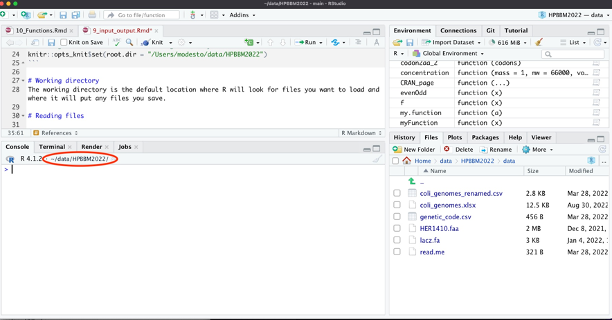

```{r wrap-hook, echo=FALSE}
library(knitr)
library(formatR)
opts_chunk$set(tidy.opts=list(width.cutoff=60),tidy=TRUE)
#in RMD files, the default wd for R code chunks is the directory that contains the Rmd document. 
#We change it here to share the working directory with all the Rmd files of the course
knitr::opts_knit$set(root.dir = "/Users/modesto/data/HPBBM2022")
```

# [Wellcome & Disclaimer]{style="color:cornflowerblue"}

This site contains the materials for the *Coding tools for Biochemistry & Molecular Biology* (Herramientas de Programación para Bioquímica y Biología Molecular) course of fall 2022 in the Bachelor's Degree in Biochemistry \@UAM. This materials are the basis for GitHub-pages-based website that can be accessed [here](https://mredrejo.github.io/HPBBM2022/). Detailed academic information about the course contents, dates and assessment only can be found at the UAM Moodle site.

All this material is open access and it is shared under [CC BY-NC](https://creativecommons.org/licenses/by-nc/2.0/) license.

# Data input & output in R

As you already know, launching R starts an interactive session with input from the keyboard and output to the screen. If you are using small datasets, you can directly define and introduce your data in the Console, as you did in the examples before. Additionally, you can define your objects and introduce your data interactively with the functions `scan()`and `readline()` as in the following examples. Regarding the output, you can just call the object by its name or use the function `print()`, which displays on the screen the contents of its argument object.

```{r}
vector <- scan(n=4)
vector2 <- scan()
str <- readline()
vector
print(vector2)
print(str)
edit(str)
```

Although, seldom used, you can also edit the contents of your objects using the function `edit()`. This function can be used to edit different objects, including vectors, strings, matrices or dataframes. MacOS users need to install XQuartz X11 tool.

# Working directory

More often, you can process commands from a script file (a file containing R statements) and also import data from text files, databases (MySQL) or other proprietary formats, such as Excel or GraphPad Prism. We will focus on text files by the moment, as importing files in specific formats requires dedicated external packages. By default, R will read/write in the *working directory (wd)*, which is indicated in your Console panel.



Note that the abbreviation '\~' stands for your home directory (for me `/Users/modesto` or `/home/modesto` on MacOS or Linux, respectively).

The functions `getwd()` and `setwd()` allow you to check and change the *wd*. As this is a Markdown document, that `setwd()` within an R chunk only changes the working directory **for that particular chunk**. Remember that you can write `?getwd()` or `?setwd()` for help.

```{r, error=TRUE}
getwd()
setwd("/Users/modesto")
getwd()
setwd("/Users/modsto/data/HPBBM2022") 
setwd("/Users/modesto/data/HPBBM2022")
getwd()
```

In RStudio, the *default working directory* can be set from the "tools" and "global options" menu. Also, you can change the *wd* for your session in the menu **Session \> Set Working Directory** and change it to that of source file (for instant your R script), the project or the selected directory in the files panel.

# Reading/writing data in R

The most common way to read your data in R is importing it as a table, using the function `read.table()`. Note that the resultant object will become a *Dataframe*, even when all the entries got to be numeric. A followup call towards `as.matrix()` will turn it into in a matrix.

In the following example we read a file called *small_matrix.csv*, located in the folder data. If we attempt to make some matrix calculations, R will force the dataframe to a matrix when possible, but it will return an Error for many matrix-specific operations or functions unless, we transform the dataframe into a matrix.

```{r error=TRUE}
sm <- read.table("data/small_matrix.csv", sep=",")
sm
is.matrix(sm)
t(sm)
sm * 3
diag(sm)
diag(as.matrix(sm))
heatmap(sm)
heatmap(as.matrix(sm))
```

You can write any data object(s) as binary data file or as text files.

```{r}

write(vector2,file="data/vector2.txt")
write.table(sm,"data/sm.csv")
write.table(sm,"data/sm2.csv", row.names = FALSE, col.names = FALSE, sep=";")

save(vector, vector2,file="data/vector2.Rdata")
save.image(file='data/myEnvironment.RData')
```

Data files in RData format can be open from the *Environment* tab or with the `load()` function

```{r}
sm_bis <- load("data/vector2.Rdata")
sm_bis
```

# Basic Data Management in R

Now we are going to import and explore an example dataset, containing metadata from an Illumina sequencing project of pathogenic *E. coli* strains (Flament-Simon et al. 2020, <https://doi.org/10.1038/s41598-020-69356-6>). However, for didactic purposes, the original data have been simplified and manipulated and the attached datasets do not fully correspond to the actual data.

## Explore a dataframe

As you can see in the R help, the function `read.table()` has several default options as FALSE, like `header=FALSE`. When you have a spreadsheet export file, i.e. having a table where the fields are divided by commas in place of spaces, you can use `read.csv()` in place of read.table(). For Spaniards, there is also `read.csv2()`, which uses a comma for the decimal point and a semicolon for the separator. The latter functions are wrappers of `read.table()` with custom default options.

```{r error=TRUE}
#Note differences between read.table(), read.csv() and read.csv2()
coli_genomes <- read.table(file = "data/coli_genomes.csv")
head(coli_genomes)
coli_genomes <- read.table(file = "data/coli_genomes.csv", sep=";", dec=".", header=TRUE)
head(coli_genomes) 
coli_genomes <- read.csv(file = "data/coli_genomes.csv")
head(coli_genomes)
coli_genomes <- read.csv(file = "data/coli_genomes.csv", sep=";")
head(coli_genomes)  
coli_genomes <- read.csv2(file = "data/coli_genomes.csv")
head(coli_genomes)

#read some data
head(coli_genomes)
tail(coli_genomes, n=2)
coli_genomes[1,]
coli_genomes[,1]
coli_genomes[1:6,2:4]

#explore the dataframe structure
dim(coli_genomes)
length(coli_genomes)
ncol(coli_genomes)
nrow(coli_genomes)
#dataframe estructure in one line
str(coli_genomes) 
#type of data in each variable
typeof(coli_genomes$Strain) 
typeof(coli_genomes[,2])
typeof(coli_genomes[,9])

#col and row names
names(coli_genomes)
colnames(coli_genomes)
rownames(coli_genomes)
names(coli_genomes[3])<-'Year'
names(coli_genomes)[3]<-'Year'
colnames(coli_genomes[3])<-'Year'

```

Some of the columns include 'chr' data that may be actually a categorical variable, so we can code them as **factor**. Using the expression *as.factor()* you can check whether the data would correspond to a text or a categorical variable.

```{r}
coli_genomes$Source<-as.factor(coli_genomes$Source)
coli_genomes$Phylogroup<-as.factor(coli_genomes$Phylogroup)

str(coli_genomes) #dataframe estructure updated
```

How many levels are there in *Source*?? It is not uncommon to see some mistake in our data, usually made when the data were recorded, for example a space may have been inserted before a data value. By default this white space will be kept in the R environment, such that 'Human' will be recognized as a different value than 'Human'. In order to avoid this type of error, we can use the *strip.white* argument.

```{r}
unique(coli_genomes$Source)
table(coli_genomes$Source)
coli_genomes <- read.csv2(file = "data/coli_genomes.csv",  strip.white = TRUE)
coli_genomes$Source<-as.factor(coli_genomes$Source)
coli_genomes$Phylogroup<-as.factor(coli_genomes$Phylogroup)

unique(coli_genomes$Source)
```

We can also rename some variables to use more easy names.

```{r}
names(coli_genomes) #see all variable names
#rename variables
names(coli_genomes)[3]<-'Year'
names(coli_genomes)[10]<-'Plasmids'
names(coli_genomes)[15]<-'Assembly_length'
names(coli_genomes)[16]<-'contigs1kb'
#check
names(coli_genomes)

```

## Change and add variables

We are going to simplify our dataframe by dropping variables:

```{r}
coli_genomes<-coli_genomes[-c(9:11),]
# this can be also used to remove rows
coli_genomes[,-1]
```

We know the 'Assembly length' and the number of 'Contigs', but we would like to represent the average contig length.

```{r}
coli_genomes$average_contig<-coli_genomes$Assembly_length / coli_genomes$Contigs
```

## Dealing with *NAs*

It is very easy to calculate statistics of one variable. Imagine we want to know the average year of sample isolation.

```{r}
mean(coli_genomes$Year.of.isolation) 
```

Yes, that error means that there are some NA values and mean cannot be calculated. We can check that and omit the NAs.

```{r}
#check if there is any NA
is.na(coli_genomes)
#na.rm=TRUE will omit the NAs for this function
mean(coli_genomes$Year.of.isolation, na.rm=TRUE)
```

What if we want to remove observations with an NA from a dataset?

```{r}
coli_genomes2<-na.omit(coli_genomes)
```

::: {#save}
Finally, we are going to save our new dataset for future examples.
:::

```{r}
write.csv2(coli_genomes,"data/coli_genomes_renamed.csv", row.names=FALSE)
```

# References

-   *An introduction to R*, <https://intro2r.com/work-d.html>

-   *R programming for data science,* <https://bookdown.org/rdpeng/rprogdatascience/>

-   Using RStudio projects, <https://support.rstudio.com/hc/en-us/articles/200526207>

-   Importar y exportar datos en R, <https://rsanchezs.gitbooks.io/rprogramming/content/chapter3/index.html>

-   *R in action.* Robert I. Kabacoff. March 2022 ISBN 9781617296055

-   R para análisis científicos reproducibles. Sofware Carpentry Foundation. <https://swcarpentry.github.io/r-novice-gapminder-es/>

# [Short exercises]{style="color:green"}

1.  Try the input/output examples from *Techvidvan* website <https://techvidvan.com/tutorials/r-input-and-output-functions/>

2.  Load the file *colis3.csv* as *colis* and explore the dataset structure.

3.  Calculate the mean of numerical variables: isolation date (*Year*), antimicrobial resistance genes (*AMR*), virulence factors (*VF*), CRISPR cassesttes (*CRISPR*), integron cassettes (*Integron*) and sequencing date (*seqs*) in those strains? Note. For the *seqs* variable you will need to use the function `as.Date()`.

4.  Save the tables *coli_genomes_renamed* and *colis* in a single *Rdata* file.

5.  Add the values of the exercise 3 as a last row in the table. Note. For the *seqs* variable you will need to use the function `format.Date()` (or just `format()`)

# Session Info

```{r}
sessionInfo()
```

# [Course home](https://mredrejo.github.io/HPBBM2022/)
