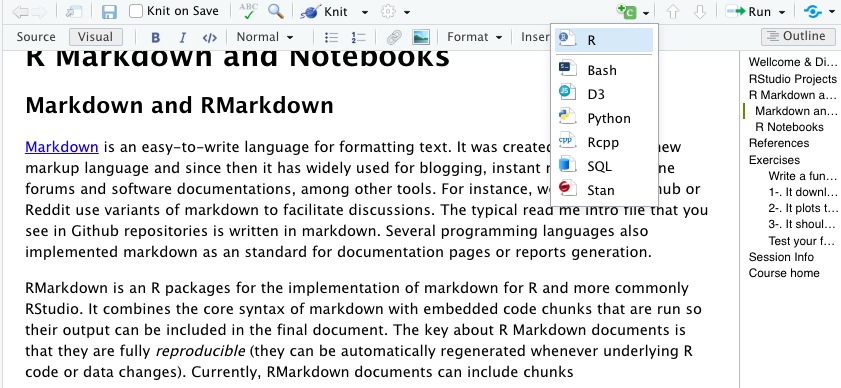

```{r wrap-hook, echo=FALSE}
library(knitr)
library(formatR)
opts_chunk$set(tidy.opts=list(width.cutoff=60),tidy=TRUE)
knitr::opts_knit$set(root.dir = "/Users/modesto/data/HPBBM2022")
options(repos = list(CRAN="http://cran.rstudio.com/")) #this is to avoid error in install.packages() at knitting
```

# [Wellcome & Disclaimer]{style="color:cornflowerblue"}

This site contains the materials for the *Coding tools for Biochemistry & Molecular Biology* (Herramientas de Programación para Bioquímica y Biología Molecular) course of fall 2022 in the Bachelor's Degree in Biochemistry \@UAM. This materials are the basis for GitHub-pages-based website that can be accessed [here](https://mredrejo.github.io/HPBBM2022/). Detailed academic information about the course contents, dates and assessment only can be found at the UAM Moodle site.

All this material is open access and it is shared under [CC BY-NC](https://creativecommons.org/licenses/by-nc/2.0/) license.

# RStudio Projects

Working with relative paths can get a little bit confusing, especially if run large projects with different folders and subfolders for data and results. A good way to avoid confusion is to make an R project in R Studio.


As you can see in the screenshot above you can easily start a new project in RStudio using the *File* menu. Then, just select a name and save it on your computer (it will be have the extension *Rproj*).

Now here's the cool part: When you open your project, you will see that the project folder will be your default relative path, which you can check with `getwd()`. Also, in the top-right corner of Rstudio you can see the project name and the containing folder.

Working with projects come along with other extra features. For instance, every time you open the project, the *.Rdata* and the *.Rhistory* are loaded; thus previously edited source documents and RStudio settings (e.g. active tabs, splitter positions, etc.) are restored. This will make a difference if you manage different projects at the same time.

There are more reasons to do this, which become more obvious as you progress as a coder and start working on collaborative projects. You can also create your project using a version control (Git or Subversion) repository. Version control helps software teams manage changes to source code over time. Version control software keeps track of every modification to the code in a special kind of database. If a mistake is made, developers can turn back the clock and compare earlier versions of the code to help fix the mistake while minimizing disruption to all team members. Version control systems have been around for a long time but continue to increase in popularity with data science workflows.

# R Markdown and Notebooks

## Markdown and RMarkdown

[Markdown](https://en.wikipedia.org/wiki/Markdown) is an easy-to-write language for formatting text. It was created in 2004 as a new markup language and since then it has widely used for blogging, instant messaging, online forums and software documentations, among other tools. For instance, websites like Github or Reddit use variants of markdown to facilitate discussions. The typical read me intro file that you see in Github repositories is written in markdown. Several programming languages also implemented markdown as an standard for documentation pages or reports generation.

RMarkdown is an R packages for the implementation of markdown for R and more commonly RStudio. It combines the core syntax of markdown with embedded code chunks that are run so their output can be included in the final document. The key about R Markdown documents is that they are fully *reproducible* (they can be automatically regenerated whenever underlying R code or data changes). Currently, RMarkdown documents can include chunks in different languages (see the screenshot below), so you can combine in the same document *bash* or *Python* scripts along with the R data analysis.



Also, they can be written using a *Visual* mode (above) that looks like any other word processor, but you can switch to *Source* anytime.


I found two main advantages in using RMarkdown documents for my data analysis. Initially, I started to use it in order to generate formatted reports including all the information about the project in a paper-like format, from the background to the data analysis and the conclusions. Indeed, those "reports" can be as fancy as you wish, from html or latex-formatted pdf, to MS Word or even presentations. A second benefit of the use of markdown is that it facilitates your own work a lot, specially when you work in several different projects or you if you need to do some analysis after some time. Additionally, you can use Rmarkdown documents for web applications based in R using [Shiny](https://shiny.rstudio.com/).

Moreover, there are a number of specialized sites to publish your Rmarkdown documents, such as [Rpubs](https://rpubs.com/), [bookdown.org](https://bookdown.org/home/about/) or [RStudio connect](https://rstudio.com/products/connect/).

## [Create your first R Markdown document]{style="color:green"}

Like any other language, learning the syntax is much easier by making some examples. We can convert in a Markdown html document one of our exercises in a few steps:

1.  Start a new R Markdown document. Initially, it will ask you a title, author and date. You can also specify here the type of output document. This data will be included in the header of your *rmd* document, a configuration section written in [YAML](https://en.wikipedia.org/wiki/YAML) format that can be edited anytime. This section also can include information about the use of a TOC (Table of Contents), section numbering, html themes...

    {width="450"}

2.  Once you have your new document, it will include some default instructions about how to write and create coding chunks. You can switch between `Source` and `Visual` format to see the difference and then **replace the instructions for some text like the exercise wording.**

3.  **Add your exercise script into one chunk and try it**. You can also split it into more than one chunk and intercalate some explanations.

4.  Add a final chunk with the `sessionInfo()` to facilitate reproducibility.

5.  **Knit it!** You can try knitting into *html*, *pdf* or *word* document.

Note that knitting into *pdf* may require the installation of a LaTeX distribution or R package. There are several alternatives, like `tinytex`, `MacTeX` or `MikTeX`, among others (see [references 9 and 10](#r9)).

## R Notebooks

Technically, **R Markdown is a file, whereas R Notebook is a way to work with R Markdown files**. R Notebooks do not have their own file format, they all use *Rmd*. All R Notebooks can be 'knitted' to R Markdown outputs, and all R Markdown documents can be interfaced as a Notebook. The R nb document is launched directly and no wizard (as in the case of .RMD) appears. Along with the notebook file, an additional html file that extension *\*.nb.html* is generated. The notebook has the option for Preview. If any code is altered or edited, the new output is not shown. The output is shown in the code editor itself. Whatever the old output was it is only rendered. No new output is generated from the code change. In order to show the code output, we need to execute the chunk and then it will appear in the output. The YAML header has output as: output: **html_notebook**

Writing an R Notebook document is no different than writing an R Markdown document. The text and code chunk syntax does not differ from what you learned in the R Markdown tutorial. The primary difference is in the interativeness of an R Notebook. Primarily that when executing chunks in an R Markdown document, **all the code is sent to the console at once**, but in an R Notebook, **only one line at a time is sent**. This allows execution to stop if a line raises an error.

# Quarto

In 2022, RStudio launched Quarto, a novel markdown flavor, based in [Pandoc](https://en.wikipedia.org/wiki/Pandoc), a free-software document converter, that expanded the possibilities of RMarkdown with new format options and enriched templates. See some examples [here](https://quarto.org/docs/gallery/).

Quarto is particularly designed to generate complex documents, like a whole website or books. It requires a *.qmd* file and a companion YAML document that includes the site/book structure, metadata and configuration. You can check the [Quarto Reference](https://quarto.org/docs/projects/quarto-projects.html#project-metadata) to learn how to configure your yml file. As an example, have a look to the [\_quarto.yml](https://github.com/StrBio/strbio2022_23/blob/main/_quarto.yml) file for this site on [Structural Bioinformatics](https://strbio.github.io/strbio2022_23/).

Besides the references below, I suggest you to check these [examples](https://quarto.org/docs/gallery/) and the this [video about the use of Quarto](https://youtu.be/y5VcxMOnj3M) to create amazing websites, books and interactive sites.

# References {#refs}

1.  *R Crash Course for Biologist.* Robert I. Coulatti. November 2022 (GitHub repository <https://github.com/ColauttiLab/RCrashCourse_Book>).

2.  RStudio Projects: <https://support.posit.co/hc/en-us/articles/200526207-Using-RStudio-Projects>

3.  Version control in R (Spanish):

    -   <https://swcarpentry.github.io/git-novice-es/14-supplemental-rstudio/>

    -   <https://rstudio-pubs-static.s3.amazonaws.com/500747_14d4ccd16023430d82d175bae0d2f5a6.html>

4.  R Markdown Cheat Sheet: <https://www.rstudio.com/wp-content/uploads/2015/02/rmarkdown-cheatsheet.pdf>

5.  Formatting HTML documents with RMarkdown: <https://bookdown.org/yihui/rmarkdown/html-document.html>

6.  r-cubed: **R**eproducible **R**esearch in **R**: <https://jose.theoj.org/papers/10.21105/jose.00122>

7.  Create interactive documents with Quarto: <https://appsilon.com/r-quarto-tutorial/>

8.  Quarto Reference Guide: <https://quarto.org/docs/guide/>

9.  ::: {#r9}
    Create PDF reports with R Markdown: [https://medium.com/\@sorenlind/create-pdf-reports-using-r-r-markdown-latex-and-knitr-on-windows-10-952b0c48bfa9](https://medium.com/@sorenlind/create-pdf-reports-using-r-r-markdown-latex-and-knitr-on-windows-10-952b0c48bfa9)
    :::

10. R Markdown and Tinytex installation: <https://bookdown.org/yihui/rmarkdown/installation.html>

# Session Info

```{r}
sessionInfo()
```

# [Course home](https://mredrejo.github.io/HPBBM2022/)

### [Lesson 9: Data input and output in R](../Lesson_9_input_output/9_input_output.html)

### [Lesson 10: Write your own functions](../Lesson_10_Functions/10_Functions.html)

### [Lesson 11: Plots](../Lesson_11_plots/11_basicplotting.html)

### [Lesson 12: Data management](../Lesson_12_data_management/12_adv_data_management.html)

### [Lesson 13: Advanced plots with ggplot](../Lesson_13_ggplot/13_ggplotting.html)

### [Lesson 14: Applications for Molecular Biology](../Lesson_14_R_for_molbiol/14_R4bqbm.html)
